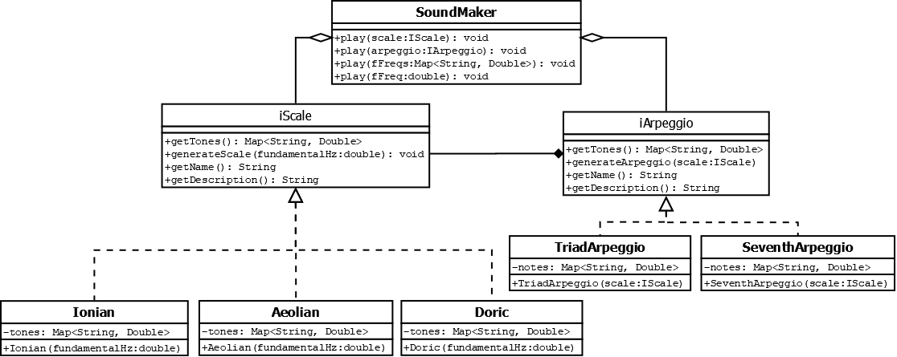

# Constructor de escalas y arpegios

## Lenguaje
Java

## Descripción
Programa para construir escalas musicales y sus arpegios fundamentales a partir de cualquier frecuencia audible.

Ejercicio de aplicación de 3 principios de programación.

### Single responsibility
Se utiliza el principio al separar en distintas clases las tareas de: 
* Construir una escala 
* Construir un arpegio sobre la escala
* Convertir el cálculo de frecuencias en una onda sinusoidal

### Open/Closed
Se utiliza el principio al establecer una interface para habilitar la extensión de distintas escalas y otra similar para distintos arpegios.

Cómo ejemplo el programa incluye mas clases de las mencionadas en el diagrama de clases que extienden la funcionalidad. Añadir una nueva escala no implica más que la creación de la clase concreta de la escala.

Similarmente sucede con los arpegios.

### Liskov substitution
Se utiliza el principio al establecer una interface de escalas en la que cualquiera de sus implementaciones puede ser reemplazada por cualquiera de las demas utilizando los mismos tipos de llamados y obteniendo el mismo tipo de salidas en cualquiera de ellas (diseño por contrato).

Similarmente sucede con los arpegios.

## Diagrama de clases
.

